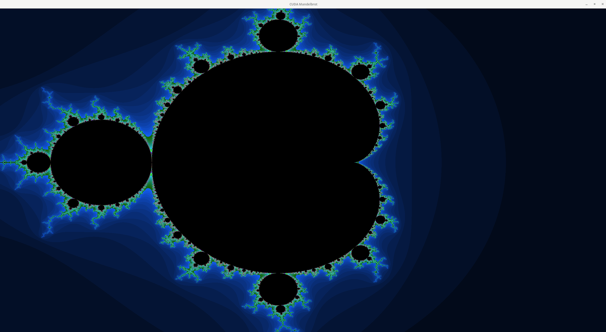

# cudafractals

cudafractals is a CUDA-powered fractal renderer that showcases the beauty and computational efficiency of GPU-accelerated Mandelbrot set visualization. This project uses OpenGL and CUDA interop to dynamically generate fractal images with infinite zoom and smooth panning capabilities. The rendering leverages GPU parallelism for real-time performance.

---

## Features
- Real-time Mandelbrot fractal rendering.
- "Infinite" zoom with double-precision calculations.
- Customizable resolution and interaction.



---

## Requirements

To build and run this project, ensure the following dependencies are installed:

### Hardware
- NVIDIA GPU with CUDA Compute Capability 3.0 or higher.

### Software
- **CUDA Toolkit** (version 10.1 or later)
- **CMake** (minimum version 3.27)
- **OpenGL**, **GLUT**, and **GLEW** libraries
- A C++17-compatible compiler

#### Example Install Commands (Ubuntu):
```bash
sudo apt update && sudo apt install -y build-essential cmake freeglut3-dev libglew-dev
```

---

## Build Instructions

1. Clone the repository:
   ```bash
   git clone https://github.com/leoforney/cuda_fractal_render
   cd cudafractals
   ```

2. Create a build directory and navigate into it:
   ```bash
   mkdir build && cd build
   ```

3. Run CMake to configure the project:
   ```bash
   cmake ..
   ```

4. Build the project:
   ```bash
   make
   ```

---

## Running the Program

Once the build process is complete, you can run the program:
```bash
./cudafractals
```

### Controls
- **Zoom In/Out**: Use the mouse wheel to zoom in and out.

---


## License
This project is licensed under the MIT License. Feel free to use, modify, and distribute as needed.
